# 整体架构

## 项目文件
- src 项目源码
  - assets 资源文件
  - components 组件
    - blocks 节点块框架
    - views 节点块内容
    - controls 参数控件
    - BaseItem.vue 模板节点块
    - BlockPanel.vue 中部工作区域
    - LeftBar.vue 左侧模板块栏
    - SettingDiloag.vue 参数设置弹窗
    - TagBar.vue 标签（任务）栏
  - router 路由
  - store 状态管理
  - styles 样式文件
  - views 视图页面
    - Home.Vue 主页面
  - App.vue VUE主文件
  - background.js electon自动生成文件
  - main.js 程序入口文件

## 模块

<div align=center>

</div>

- **节点块** 简称为**块(Block)** ，用于数据可视化及处理操作。
- **状态管理模式** 用于储存每个块的数据及软件全局信息。
- **用户工作区** 实现用户打开任务、添加模块等基本操作。
- **参数设置** 用于修改节点块的属性及参数。

## 块与其他模块的关系

<div align=center>

</div>

块控件通过**状态管理模式**注入块数据，通过**混入(Mixin)** 方式加载逻辑功能，块采用**双向数据流**，能够对注入的数据直接进行修改，每个块可以直接向下级块传输数据。参数控件为**单例模式(Singleton)** ，即软件运行时只会产生一个参数控件实例，块通过事件打开参数控件。工作区通过状态管理模式添加、删除节点块数据。

## 块继承

为了避免代码的重复编写，块之间进行了继承，提高代码的复用。

> 以`ImageReadBlock.vue`为例

- `BaseBlock` 父级块  
  - `InputBlock` 子级块  
    - `ImageReadBlock` 孙子级块  

**注意：**父级与子级是两个块的继承关系，例如`BaseBlock`和`InputBlock`两者为父子关系，而上级和下级是指两个块数据流向关系，例如`ImageReadBlock`和`ImageVisualBlock`是上下级关系，数据首先从`ImageReadBlock`读入然后在`ImageVisualBlock`进行可视化。

### 界面复用

> `Vue`目前没有提供直接的界面继承方式，即一个子级控件不能直接将父级控件的内容“复制”到自己的内容区域，但`Vue`提供了`插槽机制`，使得子控件可以将自己的内容插入到父控件的内容区域，因此通过这种方式可以实现界面的复用。


`Vue`提供了[插槽（slot）](https://cn.vuejs.org/v2/guide/components-slots.html)机制，父级块`BaseBlock`定义了块的**基本界面框架**，并设置`button`、`content`[具名插槽](https://cn.vuejs.org/v2/guide/components-slots.html#%E5%85%B7%E5%90%8D%E6%8F%92%E6%A7%BD)。子级块`InputBlock`可以将按键组件“填入”`button`槽内，或者是将内容组件“填入”`content`槽内。如果子级块后还有孙子级块，可以在子级块中再次设置插槽供孙子级块“填充”。

`BaseBlock`定义了基本的界面框架：可拖拽缩放容器，上下分为标题区域和内容区域，标题区域定义了`button`槽，并提供`设置`和`关闭`两个默认按钮。  

```html
<draggable-resizable>
  <el-header>
    <slot name="button" />
    <el-button icon="el-icon-setting" />
    <el-button icon="el-icon-circle-close" />
  </el-header>
  <el-main>
    <slot name="content" />
  </el-main>
</draggable-resizable>
```

`InputBlock`在`BaseBlock`的基础上添加了`运行/暂停`按钮。  

```html
<base-block>
  <template v-slot:button>
    <el-button
      v-if="!isRunning"
      icon="el-icon-video-play"
    />
    <el-button
      v-else
      icon="el-icon-video-pause"
    />
  </template>
  <template v-slot:content>
    <slot name="content" />
  </template>
</base-block>
```

#### 深入理解

当`Vue`构建`ImageReadBlock`时，会先后生成`BaseBlock`、`InputBlock`、`ImageReadBlock`三个`Node`实例。  

通过插槽，子控件`InputBlock`将自己的内容插入到父控件`BaseBlock`的内容区域。当用户拖拽`Block`时，`拖拽事件`会传递给`BaseBlock`进行处理，`InputBlock`不会收到；而当用户点击`运行/暂停`按钮时，`运行/暂停事件`会传递给`InputBlock`进行处理。  

如果`InputBlock`想要实现**特异化（special）**的拖拽事件回调函数，那么如何将`拖拽事件`传递给`InputBlock`呢？  

首先，`BaseBlock`先实现拖拽事件回调函数`onDrag()`，然后在回调函数中再次发出事件`$emit()`  

```js
// BaseBlock.vue
onDrag(x, y) {
      this.block.pos.x = x; // 记录拖住后的位置
      this.block.pos.y = y;
      this.$emit('dragging', x, y) // 将信号再发出去传递给子级
    },
```
    
然后，`InputBlock`绑定`拖拽事件`的回调函数`@dragging="onDrag"`。 

```html
<!-- InputBlock.vue -->
<base-block @dragging="onDrag">
  <!-- 省略 -->
</base-block>
```

如果子控件`InputBlock`不想处理`拖拽事件`，而孙子控件`ImageReadBlock`想处理`拖拽事件`呢？  

一种简单的方法是`InputBlock`实现`拖拽事件`的回调函数，但不做任何处理，直接将信号再发出去传递给子级`$emit()`。 

```js
// InputBlock.vue
onDrag(x, y) {
      this.$emit('dragging', x, y) 
    },
```

但是这种方法比较低效，一种高效的方法是通过`v-on="$listeners"`将所有来自子级`ImageReadBlock`的监听直接绑定到父级`BaseBlock`。  

```html
<!-- InputBlock.vue -->
<base-block v-on="$listeners">
  <!-- 省略 -->
</base-block>
```

### 功能复用

> `Vue`提供了[extents](https://cn.vuejs.org/v2/api/index.html#extends)选项实现一个控件扩展另一个控件的属性、数据和方法，但这种复用方法会将父控件的所有方法等都扩展到子组件上，显然这是不合理的。我们通过[混入（Mixins）](https://cn.vuejs.org/v2/guide/mixins.html)实现自定义继承属性、数据和方法。

`Vue`提供了[混入（Mixins）](https://cn.vuejs.org/v2/guide/mixins.html)机制，父级块`BaseBlock`通过`BaseMixin.js`定义了大量可复用属性及方法，子级块`InputBlock`和孙子级块`ImageReadBlock`可通过`混入`进行扩展。  

`BaseMixin.js`中分为两个部分：一个部分是控件属性选项`BasePropertyMixin`，如`tag`信息、`block`信息、`buffer`缓冲区等，这一部分选项是各级块都需要的；另一部分是功能选项`BaseFunctionMixin`，如`cycleBuffer`数据、`recv`方法、`post`方法等，这一部分选项不是每级块都需要的。  

```js
// BaseMixin.js
var BasePropertyMixin = {
  props: {
    index: {
      // ...
    },
    tagIndex: {
      // ...
    }
  }, 
  computed: {
    tag() {
      // ...
    },
    block() {
      // ...
    },
    buffer: {
      // ...
    },
  },
}

var BaseFunctionMixin = {
  methods: {
    async recv(pack) {
      // ...
    },
    async post(pack, ids) {
      // ...
    },
  },
}

export { BasePropertyMixin, BaseFunctionMixin }
export default [BasePropertyMixin, BaseFunctionMixin]
```