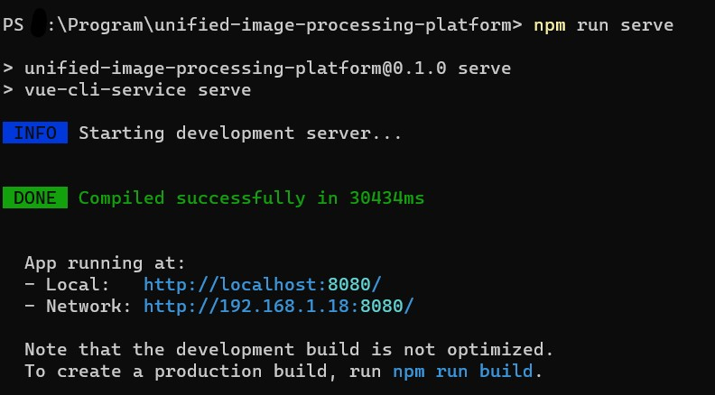
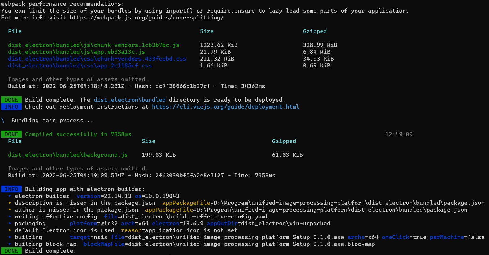

# 快速入门

## 前提
- 已搭建[Node.js](https://nodejs.org/zh-cn/) JavaScript 运行时环境
- 已全局安装[Vue-CLI](https://cli.vuejs.org/zh/)

## 部署
- 在项目**根目录**运行`npm install`安装依赖库
- 安装完成后，运行`npm run serve`在本地启动服务

- 运行`npm run electron:build`生成可执行文件（可选）


<!-- ## opencv4nodejs

1. install opencv release, which can be found here, the version I used is 3.4.x

2. disable auto build

```bash
OPENCV4NODEJS_DISABLE_AUTOBUILD=1
```

3.set system environmental variables

 -->